# Table of Contents

- [Introduction](#introduction)
- [Instruction Classification and ISA Architecture](#instruction-classification-and-isa-architecture)
- [Core Architectural Blocks](#core-architectural-blocks)
- [Simulation Results](#simulation-results)
---
# Introduction

This project presents the design and implementation of a custom 16-bit single-cycle processor using Verilog HDL. The processor is based on a user-defined instruction set architecture (ISA) and is capable of executing each instruction in a single clock cycle.

The design follows a modular approach, incorporating key components such as the Program Counter, Instruction Memory, Control Unit, Register File, ALU, and Data Memory. The processor supports fundamental operations including arithmetic, logical, memory access, and control flow instructions.

The functionality of the processor is verified through simulation using testbenches and memory initialization files.

---
# Instruction Classification and ISA Architecture

## Opcode Mapping 

The processor supports 16 instructions, each uniquely identified by a 4-bit opcode.

| Opcode | Instruction | Description |
|--------|------------|-------------|
| 0000   | ADD        | DS = S1 + S2 |
| 0001   | SUB        | DS = S1 - S2 |
| 0010   | MUL        | DS = S1 * S2 |
| 0011   | DIV        | DS = S1 / S2 |
| 0100   | XOR        | DS = S1 ^ S2 |
| 0101   | AND        | DS = S1 & S2 |
| 0110   | OR         | DS = S1 \| S2 |
| 0111   | MOV        | DS = S1 |
| 1000   | LOADI_L    | Load immediate (lower byte) |
| 1001   | LOADI_H    | Load immediate (higher byte) |
| 1010   | LOAD       | DS = MEM[ADDR] |
| 1011   | STORE      | MEM[ADDR] = DS |
| 1100   | SHL        | DS = S1 << SHAMT |
| 1101   | SHR        | DS = S1 >> SHAMT |
| 1110   | JZ         | Jump if DS == 0 |
| 1111   | NOP        | No operation |

The processor implements a fixed-length 16-bit Instruction Set Architecture (ISA) characterized by a modular 4-bit field structure. Instructions are categorized into five distinct functional groups based on their impact on the Architectural State.

### 1. Arithmetic and Logic Instructions (R-Type)

These instructions form the core of the processor's computational power, performing operations on two source registers and storing the result in a destination register.

Format:
[ OPC (4) | DS (4) | S1 (4) | S2 (4) ]

 - ALU Operations: Supports addition, subtraction, bitwise AND, OR, XOR, and an 8-bit multiplication and division
 - Data Path: Operands are fetched from the Register File and processed by the ALU in a single cycle.

### 2. Data Movement and Immediate Instructions (I-Type)

These instructions handle the initialization of registers and the movement of data between different architectural states.

Format:
[ OPC (4) | DS (4) | S1 (4) | ---- (4) ]    
Format: [ OPC (4) | DS (4) | IMM (8) ]

 - Register-to-Register: The MOV instruction allows for direct data transfer between registers.
 - Immediate Loading: MVIH and MVIL allow for loading 8-bit constants into either the upper or lower byte of a 16-bit register, enabling the construction of full 16-bit values.

### 3. Shift Instructions (S-Type)

Used for bit-level manipulation, these instructions shift the contents of a register by a specified immediate value.

Format:
[ OPC (4) | DS (4) | S1 (4) | SHAMT (4) ]

 - Shift Operations: Supports both Shift Left Logical (SLL) and Shift Right Logical (SRL).
 - Control Logic: The lower 4 bits of the instruction word are used to define the shift amount

### 4. Memory Reference Instructions (M-Type)

These instructions facilitate interaction between the processor core and the 256-word Data Memory.

Format:
[ OPC (4) | DS (4) | MEM_ADDR (8) ]

 - Load: Retrieves a 16-bit word from a specified memory address and loads it into a destination register.
 - Store: Writes the contents of a source register into the Data Memory at a designated address.

### 5. Control Flow Instructions (J-Type)

The ISA includes a specialized control instruction to enable non-linear program execution through conditional branching.

Format:
[ OPC (4) | DS (4) | JUMP_ADDR (8) ]

 - Conditional Jump (JNZ): The data of DS register evaluates to a "Jump if Zero" condition.
 - PC Update: If the condition is met, the Program Counter is updated with an 8-bit immediate address instead of incrementing sequentially.

### 6. System Control Instructions (NOP)

Performs "No Operation." 

Format:
[ OPC (4) | ---- (12) ]

 - This instruction is used to create a predictable delay or to fill empty slots in the instruction memory without affecting registers or data memory.

---

# Core Architectural Blocks 

The processor's architecture is composed of several modular functional units, each designed to handle a specific stage of the instruction cycle within a single clock period. These blocks are interconnected via a 16-bit data bus and a centralized control signals network to ensure synchronized execution. From the initial instruction fetch in the Program Counter to the final write-back in the Register File, every module plays a specialized role in maintaining the integrity of the data path.

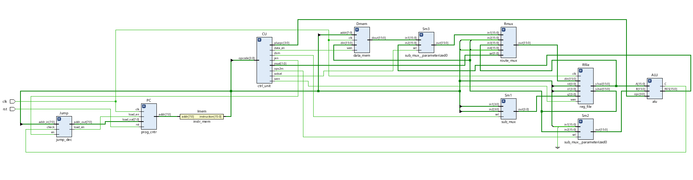

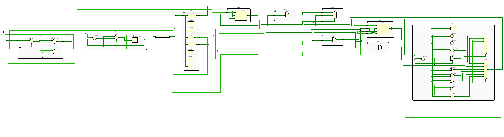

**List of Hardware Modules**
- Program Counter (PC): Manages the 8-bit instruction address.
- Instruction Memory (IMEM): Stores the 256-word instruction set.
- Register File: A $16 \times 16$-bit dual-port storage array.
- Arithmetic Logic Unit (ALU): Performs 10 distinct computational operations.
- Control Unit (CU): Generates 10 unique control signals based on the opcode.
- Data Memory: A 256-entry RAM for persistent data storage.
- Jump Decoder: Evaluates conditional branch logic.
- Multiplexers (Mux): Includes route_mux and sub_mux for dynamic data path routing.

### 1. Program Counter - [prog_cntr.v](Source%20Files/prog_cntr.v)

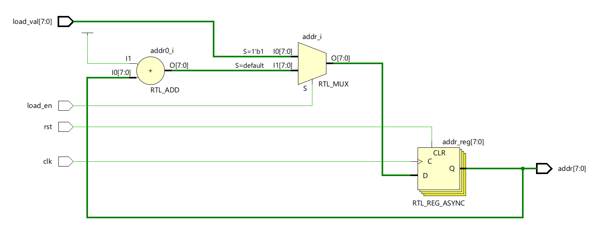

- `clk`: Master system clock.
- `rst`: Asynchronous reset; resets the address to 8'h00 on a high signal.
- `load_en`: Control signal from the Jump Decoder. If 1, the PC loads the load_val.
- `load_val [7:0]`: The 8-bit target jump address extracted from the instruction.
- `addr [7:0]`: The current instruction address output to Instruction Memory.

### 2. Instruction Memory - [instr_mem.v](Source%20Files/instr_mem.v)

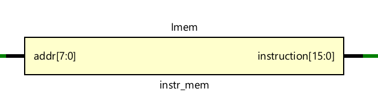

- `addr [7:0]`: Input address from the Program Counter.
- `instruction [15:0]`: 16-bit instruction word stored at the current address.

### 3. Register File - [reg_file.v](Source%20Files/reg_file.v)

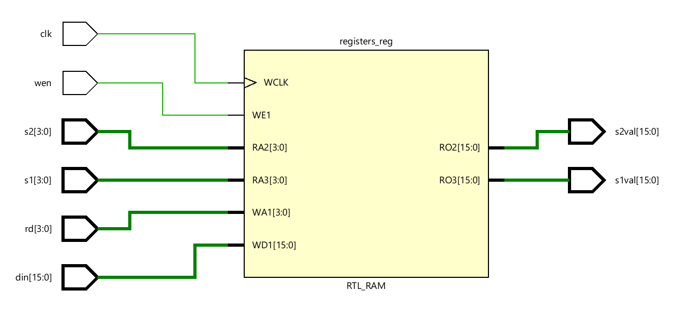

- `clk`: System clock for synchronous write operations.
- `s1 [3:0]`: Address for the first source register (read).
- `s2 [3:0]`: Address for the second source register (read).
- `rd [3:0]`: Address for the destination register (write).
- `wen`: Write-enable signal; data is written to register rd only when this is high.
- `din [15:0]`: 16-bit data input from the route_mux to be stored in the register file.
- `s1val [15:0]`: Asynchronous output of the data stored in register s1.
- `s2val [15:0]`: Asynchronous output of the data stored in register s2.

### 4. Arithmetic Logic Unit - [alu.v](Source%20Files/alu.v)

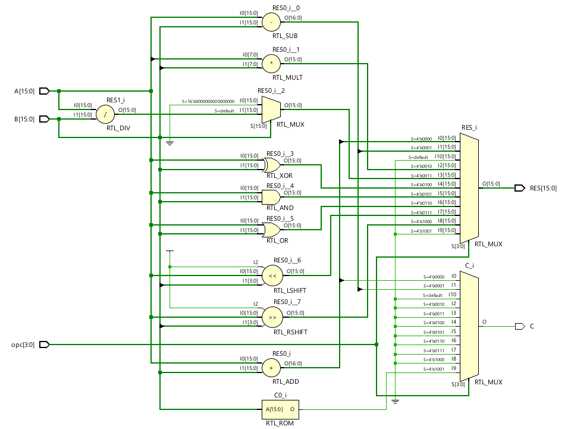

- `A [15:0]`: Primary 16-bit operand (usually from s1val).
- `B [15:0]`: Secondary 16-bit operand (usually from s2val_m).
- `opc [3:0]`: ALU opcode determining the specific mathematical or logical operation.
- `RES [15:0]`: The 16-bit result of the operation.
- `C`: Status flag; functions as a Carry bit for arithmetic or a Zero-check flag for Jumps.

### 5. Control Unit - [ctrl_unit.v](Source%20Files/ctrl_unit.v)

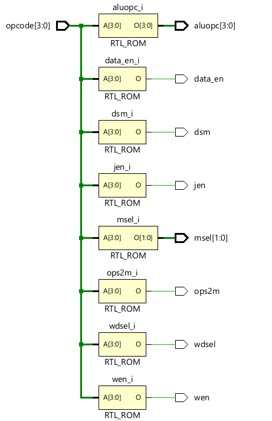

- `opcode [3:0]`: The 4-bit opcode extracted from instruction[15:12].
- `aluopc [3:0]`: Translated 4-bit code sent to the ALU to trigger specific operations.
- `msel [1:0]`: Selection bits for the route_mux (chooses write-back source).
- `wen`: Global write-enable for the Register File.
- `data_en`: Write-enable for the Data Memory (active during STORE).
- `jen`: Jump enable signal; tells the Jump Decoder to evaluate the branch condition.
- `dsm`: Selects between the instruction field s2 or the ds field for register addressing.
- `ops2m`: Selects between register data or immediate values for the ALU's second operand.
- `wdsel`: Write-data selection; chooses between ALU result or Data Memory output.

### 6. Data Memory - [data_mem.v](Source%20Files/data_mem.v)

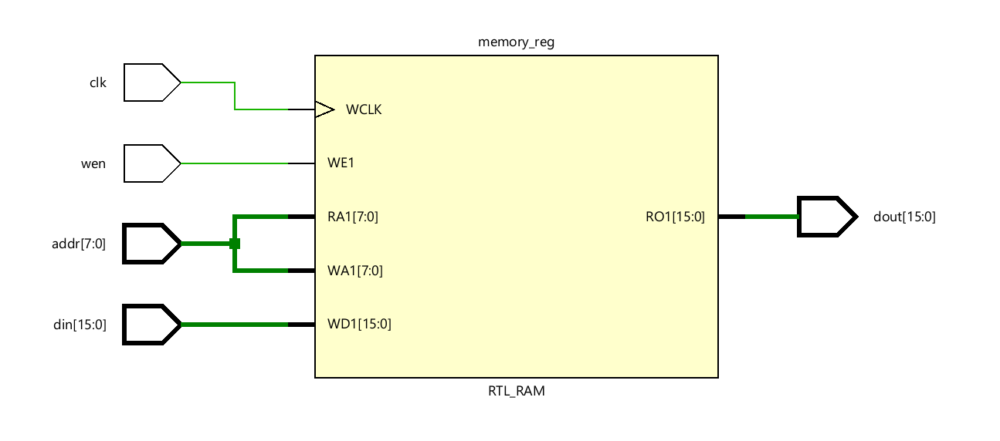

- `clk`: System clock for synchronous writes.
- `addr [7:0]`: 8-bit memory address (from the instruction immediate).
- `wen`: Write-enable signal from the Control Unit.
- `din [15:0]`: 16-bit data to be stored (from register s2val).
- `dout [15:0]`: 16-bit data read from the memory at the specified address.

### 7. Jump Decoder - [jump_dec.v](Source%20Files/jump_dec.v)

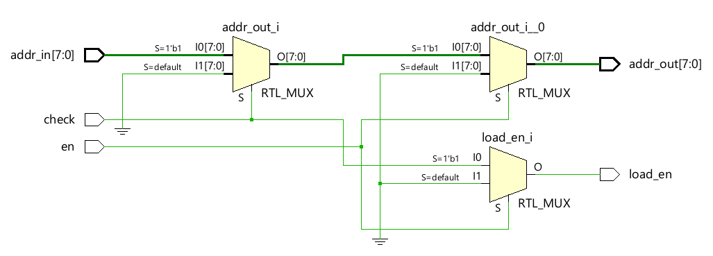

- `en`: Enable signal from the Control Unit (jen).
- `check`: Status bit from the ALU (C).
- `addr_in [7:0]`: The potential jump target address from the instruction.
- `addr_out [7:0]`: The address sent to the PC (equals addr_in if jump is taken).
- `load_en`: Output to the PC triggering a branch when high.

### 8. Route Multiplexer - [route_mux.v](Source%20Files/route_mux.v)

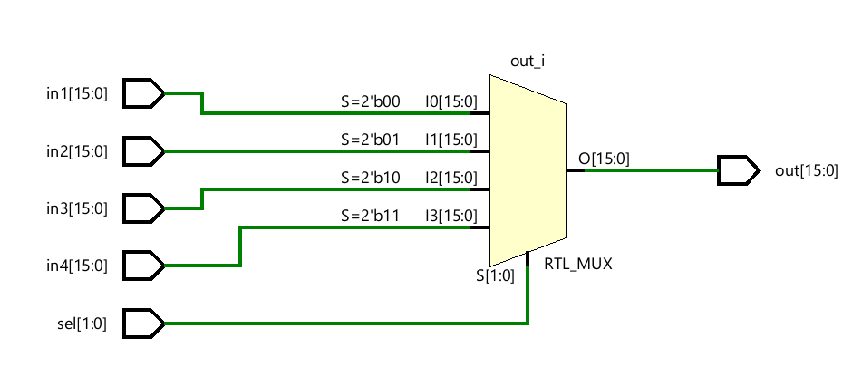

- `sel [1:0]`: 2-bit selection input from the Control Unit.
- `in1, in2, in3, in4 [15:0]`: Data sources including ALU/Memory results, register moves, and byte-immediates.
- `out [15:0]`: The final 16-bit word sent to the Register File din. 

### 9. Sub-Multiplexer - [sub_mux.v](Source%20Files/sub_mux.v)

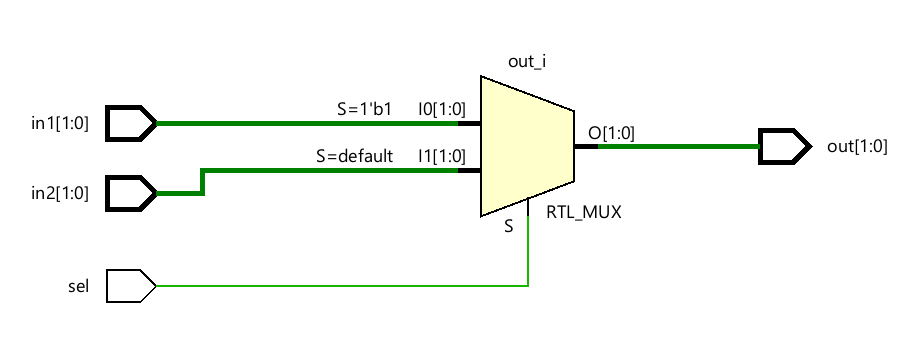

- `sel`: 1-bit selection signal.
- `in1, in2 [N-1:0]`: Parameterized inputs (used for both 4-bit address and 16-bit data routing).
- `out [N-1:0]`: The selected output path based on the control signal.

---

# Simulation Results

A testbench [processor_tb.v](Source%20Files/processor_tb.v) simulates the hardware. It initializes the registers and memory to zero, loads a program from an external file called program.txt into the instruction memory, and applies a reset signal to begin execution.
To verify the functionality of the processor, a [test program](Source%20Files/program.txt) was written in hexadecimal and loaded into the instruction memory using a TXT file. The program covers all major instruction types including arithmetic, logical, memory, shift, and control flow operations.

### Test Program Coverage

The following operations were successfully verified:

- Immediate loading (lower and higher byte)
- Arithmetic operations: ADD, SUB, MUL, DIV
- Logical operations: AND, OR, XOR
- Register-to-register data movement
- Memory operations: LOAD and STORE
- Shift operations: Left Shift and Right Shift
- Conditional jump (Jump if Zero)

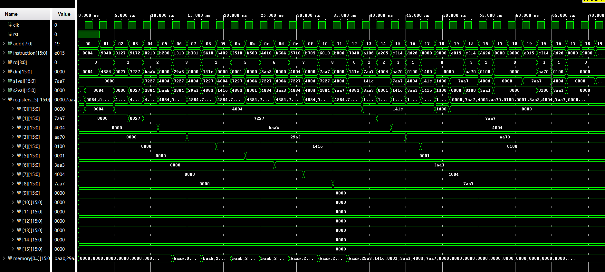

The test program initializes registers with given values, performs operations, and stores results into data memory for verification.

